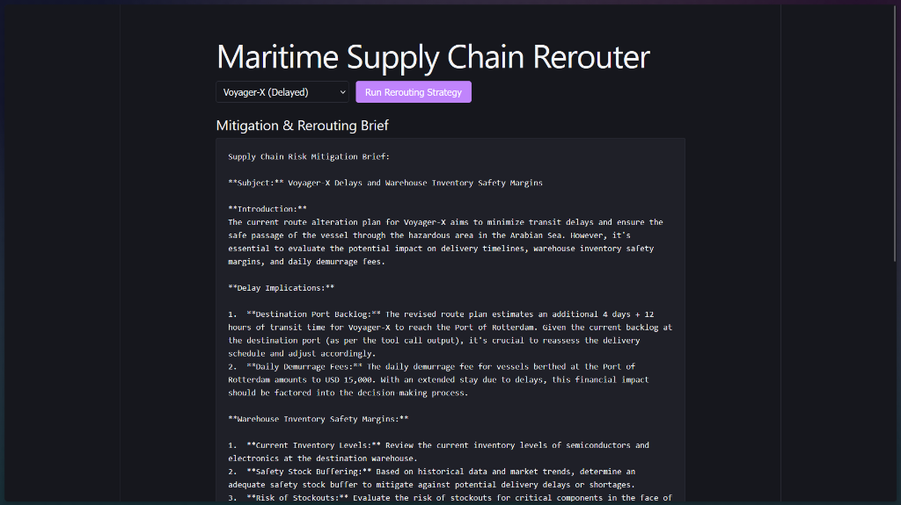

# Multi-Agent Maritime Supply Chain Monitoring and Rerouting System

This system is a modular, multi-agent solution designed to monitor vessel positions, identify route anomalies or hazards, calculate optimized alternative paths, and analyze downstream supply chain and port impacts. It is built using the CrewAI framework and orchestrates local LLM processing via Ollama.

The system features a **FastAPI backend** that streams live CrewAI agent terminal execution logs directly to a modern, minimal **React frontend** built with Vite.



## System Architecture

The backend orchestrates three specialized CrewAI agents executing sequentially:

1. **Maritime Operations Monitor**: Uses vessel telemetry to track positions, coordinates, and active disruptions.
2. **Dynamic Rerouting Strategist**: Analyzes disruptions to calculate alternative paths and ETA offsets.
3. **Supply Chain Impact Analyst**: Evaluates changes against port backlogs, demurrage fees, and warehouse safety margins to produce a risk mitigation brief.

### Real-Time stdout Streaming
The FastAPI server redirects `sys.stdout` dynamically during execution and streams the agent stdout logs character-by-character as a standard HTTP `ReadableStream` to the React client, displaying real-time text logs in a terminal window.

---

## Directory Structure

```text
maritime-rerouter/
├── ai/
│   ├── config/
│   │   ├── agents.yaml
│   │   └── tasks.yaml
│   ├── tools/
│   │   └── api_tools.py
│   ├── agent.py (Orchestration logic)
│   └── main.py (FastAPI streaming server)
├── frontend/
│   ├── src/
│   │   ├── App.jsx (React UI + Stream Reader)
│   │   ├── main.jsx
│   │   └── index.css
│   ├── index.html
│   ├── package.json
│   └── vite.config.js
├── requirements.txt
├── screenshot.png
└── README.md
```

---

## Prerequisites

1. Install [Ollama](https://ollama.com/) on your machine.
2. Pull the 8B parameter model (`llama3.1:8b`):
   ```bash
   ollama pull llama3.1:8b
   ```
3. Make sure the Ollama server is running locally at `http://localhost:11434`.

---

## Run Instructions

You will need to open **two terminal windows** (one for the backend, one for the frontend).

### 1. Run the FastAPI Backend

1. Open a terminal and navigate to the project root:
   ```powershell
   cd maritime-rerouter
   ```
2. Activate the Python virtual environment:
   * **On Windows (PowerShell):**
     ```powershell
     .\venv\Scripts\Activate.ps1
     ```
   * **On macOS/Linux:**
     ```bash
     source venv/bin/activate
     ```
3. Install dependencies:
   ```bash
   pip install -r requirements.txt
   ```
4. Start the backend server:
   ```bash
   python -m uvicorn ai.main:app --host 127.0.0.1 --port 8000
   ```

The backend is now live at [http://127.0.0.1:8000](http://127.0.0.1:8000).

---

### 2. Run the Vite React Frontend

1. Open a second terminal and navigate to the `frontend` folder:
   ```bash
   cd maritime-rerouter/frontend
   ```
2. Install frontend dependencies:
   ```bash
   npm install
   ```
3. Start the React development server:
   ```bash
   npm run dev
   ```

The frontend client is now live at [http://localhost:5173](http://localhost:5173). Open this URL in your web browser, choose your ship, and watch the agents run live in the streaming log terminal!
